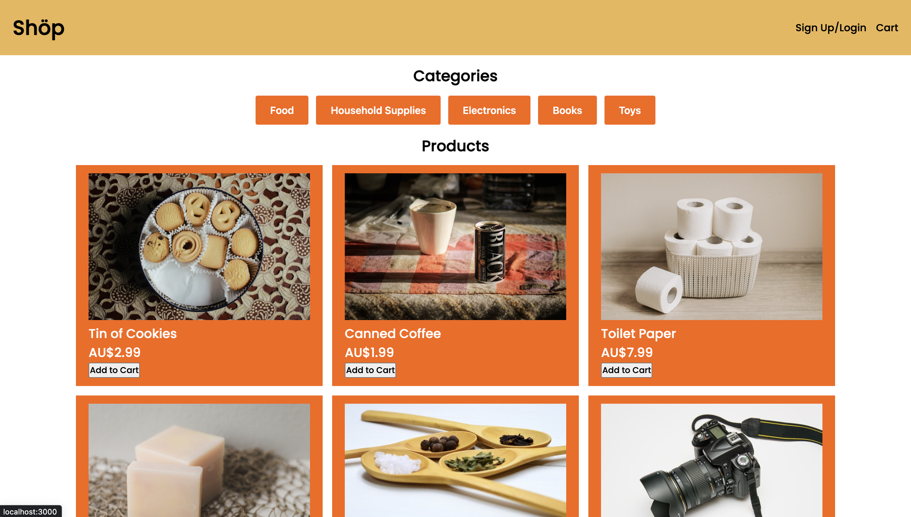
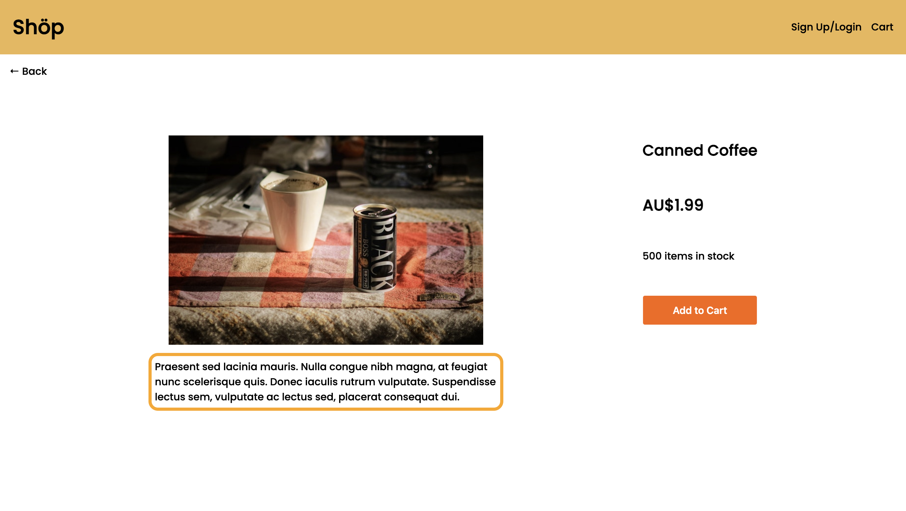
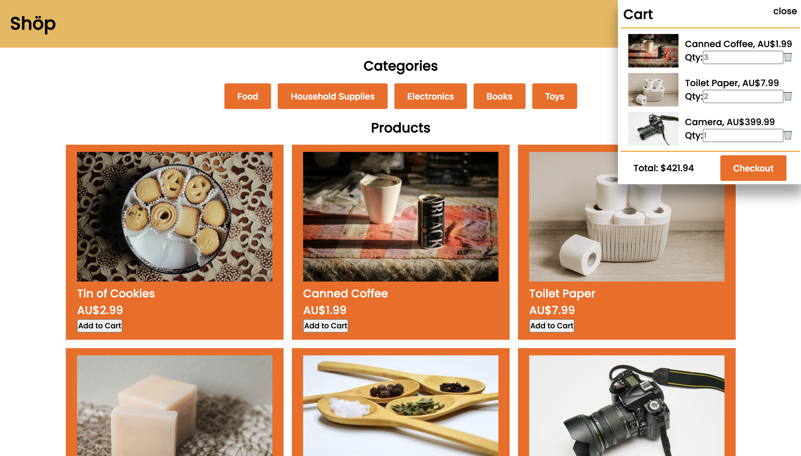

# E-Commerce Shop

## Description

This e-commerce shop is a basic e-commerce website where the user can browse through the store's products, add them to their cart, checkout and purchase the items in their cart.

I've decided to make a basic e-commerce website for my final project as e-commerce websites can have a lot of features added to them. My plan for this website is to continue to work on it to add more features, clean up and improve the presentation of the website, and overall improve my skills and knowledge of web development.

<!-- Deployed application link: [Workout-Tracker](https://ancient-eyrie-19788.herokuapp.com/) -->

## Table of Contents

- [User Story](#user-story)
- [Acceptance Criteria](#acceptance-criteria)
- [Technologies used](#technologies-used)
- [Installation](#installation)
- [Usage instructions](#usage-instructions)
- [Preview of the application](#preview-of-the-application)
- [Credits](#credits)

## User Story

```md
AS AN impulsive consumer
I WANT a functional, polished ecommerce website
SO THAT I can buy anything that I want
```

## Acceptance Criteria

```md
WHEN I open the website
THEN I am presented with a polished website that shows a list of items with an image, title and price
WHEN I click on an item
THEN I am taken to another page which shows a description of the item and a button to add to cart
WHEN I click the add to cart button
THEN the item is added to my cart
WHEN I want to checkout
THEN I am redirected to the stripe payment page
```

## Technologies used

## Installation

No installation required.

## Usage instructions

### First time user

<!-- 1. Visit [Workout-Tracker](https://ancient-eyrie-19788.herokuapp.com/) -->

2. Click on signup/login to make an account
3. Enter your name, email address and password
4. Click on Sign up.

### Returning user

<!-- 1. Visit [Workout-Tracker](https://ancient-eyrie-19788.herokuapp.com/) -->

2. Click on signup/login to make an account
3. Enter your email address and password
4. Click on Login.

## Preview of the application

### Home Page



### Product Page



### Home Page with Cart Open



## Credits

Made by

- [Brodie Marshall](https://github.com/brodie02)
